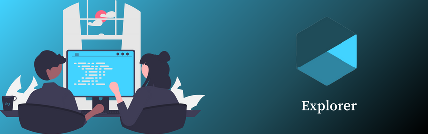

# Explorer



Este é o repositório de **desafios e projetos** do curso **Explorer** da **Rocketseat**. Este curso foi feito para formar novos programadores que estão começando do zero.

**Obs**: vou postar somente minhas respostas dos desafios e os projetos feitos no curso, tudo adaptado a minha maneira,também não irei postar o figma dos projetos.

---

###  Instalação e Execução do Projeto

- Clone este repositório

```
> git clone https://github.com/Mar0la/Explorer
```

- Navegue até a pasta desejada. ⬇️ Exemplo ⬇️

```
> node .\nivel1
```

- Instale as dependências com o npm

```
> npm install
```

---


### Desafios/projetos por níveis

**Nível 1**
  - **Não tem projeto, tem alguns quizes básicos, o foco maior é uma introdução ao mundo vasto da programação**

###

**Nível 2**
 - **Introdução aohtml e css**
   -  **corrigindo-bugs**
      - [Repositório](https://github.com/Mar0la/Explorer/tree/main/nivel2/introdução-ao-html-css/corrigindo-bugs)
      - [Deploy](https://mar0la.github.io/Explorer/nivel2/introdução-ao-html-css/corrigindo-bugs/index.html)
   -  **recriando-layoute**
      - [Repositório](https://github.com/Mar0la/Explorer/tree/main/nivel2/introdução-ao-html-css/recriando-layoute)
      - [Deploy](https://mar0la.github.io/Explorer/nivel2/introdução-ao-html-css/recriando-layoute/index.html)
- **Conhecendo novos conceitos de html e css**
  - **corrigindo-bugs**
    - [Repositório](https://github.com/Mar0la/Explorer/tree/main/nivel2/conhecendo-novos-conceitos-de-html-e-css/corrigindo-bugs)
    - [Deploy](https://mar0la.github.io/Explorer/nivel2/conhecendo-novos-conceitos-de-html-e-css/corrigindo-bugs/index.html)
  - **semantica-e-acessibilidade**
    - [Repositório](https://github.com/Mar0la/Explorer/tree/main/nivel2/conhecendo-novos-conceitos-de-html-e-css/semantica-e-acessibilidade)
    - [Deploy](https://mar0la.github.io/Explorer/nivel2/conhecendo-novos-conceitos-de-html-e-css/semantica-e-acessibilidade/index.html)
  - **recriando-layoute**
    - [Repositório](https://github.com/Mar0la/Explorer/tree/main/nivel2/conhecendo-novos-conceitos-de-html-e-css/recriando-layoute)
    - [Deploy](https://mar0la.github.io/Explorer/nivel2/conhecendo-novos-conceitos-de-html-e-css/recriando-layoute/index.html)


#

**Nível 3**
- **Avançando no html e css**
  - **criando-formularios**
    - [Repositório](https://github.com/Mar0la/Explorer/tree/main/nivel3/avançando-no-html-e-css/criando-formularios)
    - [Deploy](https://mar0la.github.io/Explorer/nivel3/avançando-no-html-e-css/criando-formularios/index.html)


###